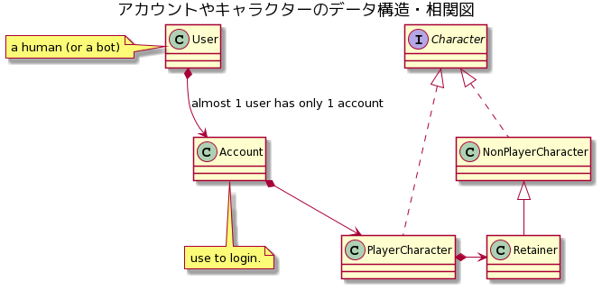
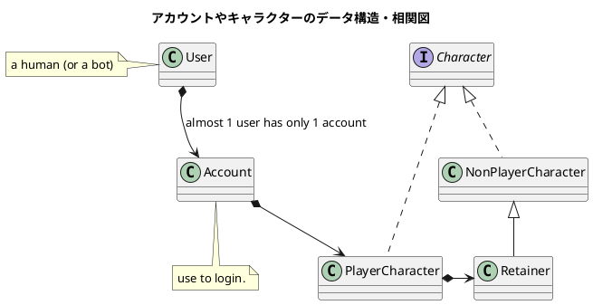

FF14 の場合のデータ構造だけれど、おそらく他のネトゲなどにも適用できる構造だと思う。

```puml
@startuml
title アカウントやキャラクターのデータ構造・相関図
class User
note left
  a human (or a bot)
end note
class Account
note bottom
  use to login.
end note
interface Character
class PlayerCharacter implements Character
class NonPlayerCharacter implements Character
class Retainer extends NonPlayerCharacter

User *--> Account : almost 1 user has only 1 account
Account *--> PlayerCharacter
PlayerCharacter *-> Retainer
@enduml
```
