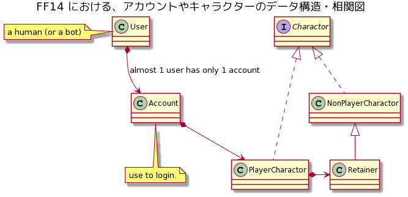
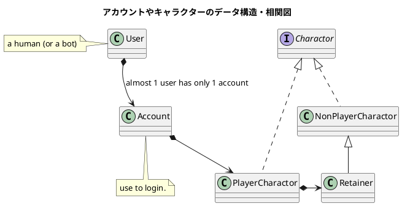

FF14 の場合のデータ構造だけれど、おそらく他のネトゲなどにも適用できる構造だと思う。

```puml
@startuml
title アカウントやキャラクターのデータ構造・相関図
class User
note left
  a human (or a bot)
end note
class Account
note bottom
  use to login.
end note
interface Charactor
class PlayerCharactor implements Charactor
class NonPlayerCharactor implements Charactor
class Retainer extends NonPlayerCharactor

User *--> Account : almost 1 user has only 1 account
Account *--> PlayerCharactor
PlayerCharactor *-> Retainer
@enduml
```
